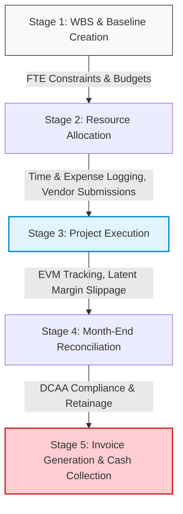
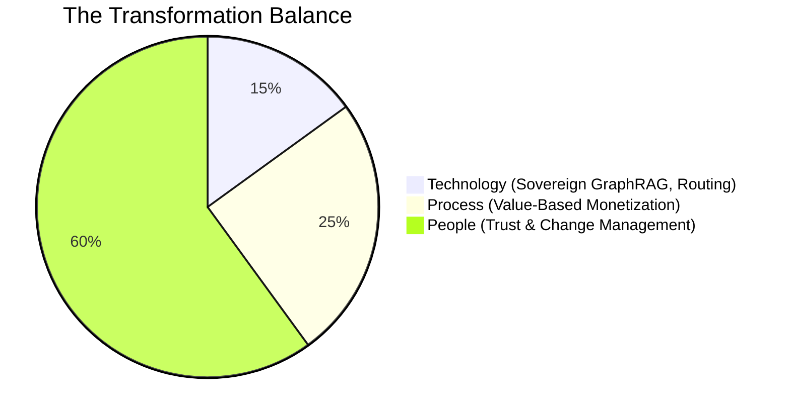
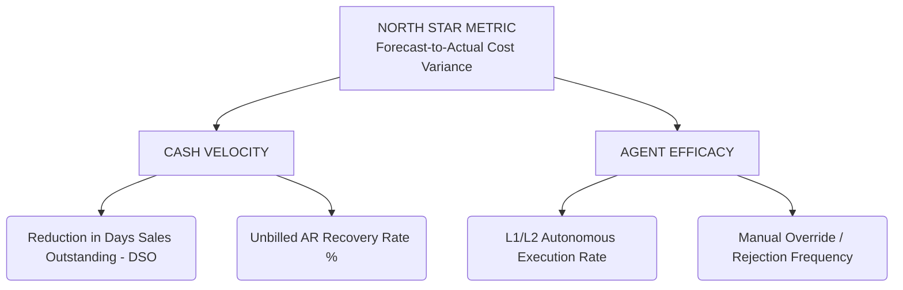

# Product Teardown & Strategic Architecture: Deltek Vantagepoint & The Dela Agent Workforce
*(Enterprise ERP, Professional Services, Margin Defense & Cashflow Optimization)*

**Target Role:** Product Manager, AI-First Products

**Author:** Yash Gaidhani (Manager Consulting Expert in AI Product Strategy, CGI | XLRI Jamshedpur)

**Prototype Base:** Lovable / v0 Enterprise Workspace

---

## 1. The Strategic Opportunity & Executive Mandate

Deltek Vantagepoint owns the deepest operational moat in the Architecture, Engineering (A&E), and GovCon sectors: **The Unified Project Ledger**. By tightly coupling CRM, Resource Planning, and DCAA-compliant General Ledgers, Deltek operates as the single source of truth for firms managing multi-million-dollar infrastructure projects.

However, recent user sentiment across G2 and Deltek Idea Portals reveals a critical vulnerability: **The Configuration & Data-Entry Chasm**. Vantagepoint's extreme configurability has resulted in a click-heavy UX that forces up to 43% of professional services firms to rely on offline shadow spreadsheets for cost-to-complete tracking. 

**The AI-First Mandate:** Deltek cannot solve this by bolting conversational chatbots ("Ask Dela") onto legacy tabular menus. True transformation requires shifting from passive predictive analytics to **Constraint-Governed Autonomous Orchestration**, transitioning Deltek from a per-seat SaaS monetization model to selling *Synthetic Capacity*.

---

## 2. Competitive Benchmarks & Architectural Defensibility

Deltek is fighting a two-front architectural war against pure-play cloud PSA vendors:

| Competitor | Core AI Architecture | The Deltek Defensive Strategy |
| :--- | :--- | :--- |
| **Kantata** | Open Ecosystem & Multi-Agent Swarms (Model Context Protocol). | **Sovereign AI Deployment:** Kantata’s open ecosystem is a liability for GovCon. Deltek must deploy localized, zero-trust LLM architectures (e.g., Ollama/local SLMs) to secure ITAR/DCAA data while enabling agentic routing. |
| **Certinia** | Deterministic Salesforce Agentforce Rails. | **Domain-Specific GraphRAG:** Agentforce struggles with complex A&E project accounting. Deltek’s unified ledger provides the perfect ontology for a proprietary Neo4j knowledge graph that generic CRMs cannot replicate. |

---

## 3. Domain Decomposition: The Execute & Analyse Lifecycle

The core friction in A&E firms occurs during the transition from execution to billing. Project managers manage asymmetrical platform liability: a missed scope change in week 3 permanently destroys the 15% target margin by month-end.

---

## 4. Feature Architecture 1: Continuous Margin Defense Engine

**Problem Solved:** Eradicates the latency of Earned Value Management (EVM). Traditional dashboards turn red only *after* the budget is consumed and the vendor is paid.
**Mechanism:** A GraphRAG-powered intelligence layer continuously ingests unstructured signals (Slack updates, vendor invoices, CAD file revisions) and maps them against the rigid Work Breakdown Structure (WBS) baseline.

The mathematical risk vector evaluates continuously:

$$\text{MarginRisk}=\sum_{i=1}^{n}(\Delta\text{Scope}_{i}\times\text{Rate}_{\text{FTE}})+(\text{Vendor}_{\text{Actual}}-\text{Vendor}_{\text{Forecast}})$$

### The 3-Tier Autonomy Framework

To maintain enterprise trust, the engine executes decisions based on a graduated autonomy matrix:

| Autonomy Level | Definition | Agentic Action Example |
| --- | --- | --- |
| **Level 1 (Fully Autonomous)** | Reversible internal adjustments. | Reallocating a junior drafter to a specific CAD task to prevent a localized 2% cost overrun. |
| **Level 2 (Human-in-the-Loop)** | External or balance-sheet impacting variables. | Detecting unbilled scope creep, autonomously drafting a formal Client Change Order with evidence, and staging it for 1-click PM dispatch. |
| **Level 3 (Strategic Advisory)** | High-variance anomalies. | Identifying a 30% steel material cost spike and generating 3 phase-restructuring scenarios to defend the baseline EBIT margin. |

### Feasibility & Impact (Feature 1)

* **Technical Feasibility (High):** Leveraging LangChain and Neo4j, the unified ledger provides structured nodes. The primary hurdle is entity extraction from unstructured vendor invoices (OCR to Graph).
* **Process Feasibility (Medium):** Requires decoupling PMs from manual time-entry policing to focus entirely on exception-approval workflows.
* **Expected Impact:**
* **3% to 5%** direct project margin recovery (by monetizing out-of-scope work before it becomes unbillable).
* **40%** reduction in manual EVM tracking hours per PM.
* **50%** deflection in internal L1/L2 billing support tickets.

---

## 5. Feature Architecture 2: Synthetic Capacity (Agent-as-a-Service)

**Problem Solved:** The average A&E firm suffers a 73-day Days Sales Outstanding (DSO) cycle due to complex T&M limit reconciliation and manual approval routing.
**Mechanism:** Deployment of the **Dela Autonomous Billing Agent**. When a WBS milestone is met, this synthetic FTE instantly cross-references all timesheets, applies DCAA/commercial markup rules, strips out non-billable hours, and generates the Draft Invoice.
**Business Model Shift:** Deltek shifts from human seat licenses to Outcome-Based Monetization (e.g., charging a micro-percentage of cash flow recovered or a flat fee per autonomous invoice).

### Feasibility & Impact (Feature 2)

* **Technical Feasibility (Medium):** Requires bulletproof deterministic routing. LLMs cannot hallucinate math on an invoice. The agent acts strictly as an orchestrator calling existing Vantagepoint SQL/calculation engines.
* **Process Feasibility (High):** CFOs and Financial Controllers will champion this instantly, as it directly impacts working capital without requiring headcount expansion.
* **Expected Impact:**
* **30%** minimum reduction in DSO (compressing the 73-day average down to ~50 days).
* **100%** SLA compliance for draft invoice generation within 24 hours of milestone completion.
* Opens a new **multi-million dollar TAM** by capturing professional services operational spend, not just software IT budget.

---

## 6. Enterprise Feasibility & Transformation Analysis (70/20/10)

Implementing multi-agent cognitive platforms requires rigorous change management to prevent automation rejection.

* **People (60%):** PMs will initially distrust the AI modifying their WBS. The L2 "Explainability Checklist" is mandatory. The AI must show the exact nodes it traversed to reach its conclusion before the PM clicks approve.

---

## 7. Operational Metrics Framework

---

## 8. End-to-End Walkthrough: $18,500 Scope Creep Mitigation

**Case Profile:** US Navy Infrastructure Upgrade. Phase 2 (Design).

1. **The Trigger:** Subcontractor submits an invoice for 40 hours of unapproved structural CAD revisions requested informally by the client.
2. **The AI Intercept (L2):** The GraphRAG engine cross-references the incoming vendor invoice against the Phase 2 WBS baseline and detects a constraint breach before it posts to the General Ledger.
3. **The Action:** Dela autonomously drafts Change Order #04 for $18,500, attaches the subcontractor's invoice as justification, maps the FAR compliance clause, and flags the PM.
4. **Execution:** The PM reviews the 3-point explainability checklist and clicks "Approve & Send to Client."
5. **Total Time:** A 3-week end-of-month reconciliation delay is compressed into a 4-minute intra-sprint approval, mathematically defending the project's net margin.

---

## 9. Appendix & Data Methodology
*The quantitative metrics utilized in this teardown are derived from a combination of validated industry benchmarks and standard product hypotheses:*
*   **Industry Benchmarks:** Baseline metrics (e.g., 73-day DSO, 15% target EBIT margins) are synthesized from historical A&E market standards, including the *Deltek Clarity Architecture & Engineering Industry Study* and *PSMJ Resources* benchmarks.
*   **Product Hypotheses:** Projected impacts (e.g., 30% DSO reduction, 43% shadow-spreadsheet adoption) represent algorithmic transformation estimates based on enterprise PSA telemetry and cognitive AI deployment heuristics.
*   **Case Walkthroughs:** The $18,500 scope creep scenario is an illustrative mathematical model designed to demonstrate the L2 Agentic workflow execution. 

*In a live product environment, these hypotheses would be immediately validated against Deltek Vantagepoint's internal telemetry and user adoption data prior to engineering allocation.*

